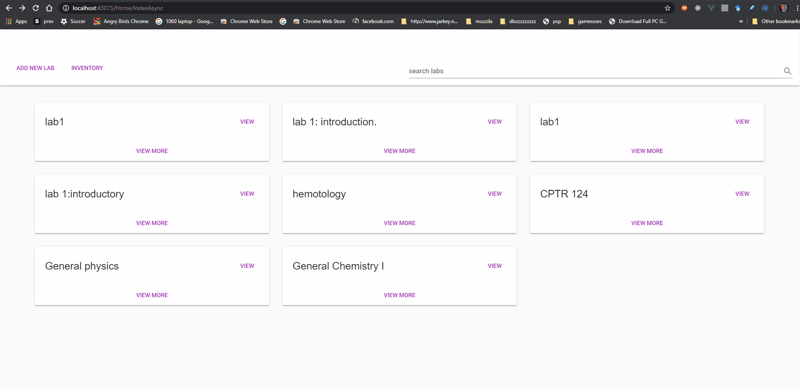

 
<h2>Key features:</h2>
<ul>
    <li>Create Labs.</li>
    <li>Add inventory.</li>
    <li>Create inventory</li>
</ul>

<h2>Technologies</h2>

.NET Framework, Vue.js, Vuetify, Google Firestore

<h2>Still in development</h2>

<h2>Run</h2>

run on any visual studio 2014 and above

<h2>Demo</h2>

go to this link: https://www.youtube.com/watch?v=LFlfeeMVN0I&t=12s

<strong>adding inventory</strong>

<strong>adding labs</strong>

